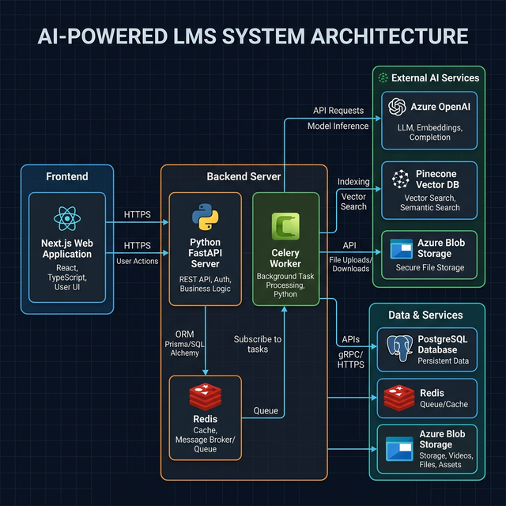

<div align="center">
  
</div>

# Lumina

A modern, full-stack learning platform supercharged with AI capabilities for automated grading, document chatting, and intelligent course management.

## 🏗️ System Architecture

The project is built with a modern microservices-oriented architecture:

- **Frontend**: Next.js (React 18), Tailwind CSS, Zustand for state management, React Query.
- **Backend API**: FastAPI (Python 3), SQLAlchemy ORM via async PostgreSQL drivers.
- **Background Tasks**: Celery with Redis as the message broker.
- **Database**: PostgreSQL 15 for relational data, Redis 7 for caching and queues.
- **AI Integrations**: 
  - Azure OpenAI for LLM inference (chat and grading).
  - Pinecone for vector search (RAG).
  - Azure Blob Storage for document management.

See the architecture diagram below:



## 🚀 Features

- **Role-Based Access Control**: Differentiated views for Students, Teachers, and Admins.
- **Course & Module Management**: Create and organize course content hierarchically.
- **Lumina AI Chat**: Upload course materials (PDF, DOCX) and let students chat directly with the documents using Retrieval-Augmented Generation (RAG).
- **Automated AI Grading**: Teachers can auto-grade student submissions based on custom rubrics.
- **Attendance Tracking**: Built-in system to manage and track class attendance.

## 🛠️ Local Development Setup

Prerequisites: Docker, Docker Compose, Node.js 20+, Python 3.11+.

### 1. Environment Variables

Provide the following keys in your `.env` (backend) and `frontend/.env.local`:
- Azure OpenAI credentials (`AZURE_OPENAI_KEY`, `AZURE_OPENAI_ENDPOINT`, `AZURE_OPENAI_DEPLOYMENT`)
- Azure Blob Storage credentials (`AZURE_STORAGE_CONNECTION_STRING`, `AZURE_STORAGE_ACCOUNT_NAME`, `AZURE_STORAGE_ACCOUNT_KEY`, Containers)
- Pinecone API Key (`PINECONE_API_KEY`)
- Next.js API URL (`NEXT_PUBLIC_API_URL`)
- Security (`JWT_SECRET_KEY`)

### 2. Run via Docker Compose

The easiest way to get everything running locally is through Docker Compose, which spins up Postgres, Redis, the FastAPI backend, and the Next.js frontend.

```bash
docker-compose up --build
```

- **Frontend**: `http://localhost:3000`
- **Backend API**: `http://localhost:8000/api/v1`
- **API Docs (Swagger)**: `http://localhost:8000/docs`

### 3. Database Migrations

If running outside Docker or to apply new changes:
```bash
cd backend
alembic upgrade head
```

## 📁 Project Structure

- `/backend`: FastAPI Python server containing the core logic (`app/`), database models (`app/models/`), background tasks/AI (`app/ai/`), and API endpoints (`app/api/v1/endpoints/`).
- `/frontend`: Next.js React application utilizing modern App Router (`src/app/`), shared components (`src/components/`), and custom hooks/stores.
- `docker-compose.yml`: Orchestrates the local development environment.
